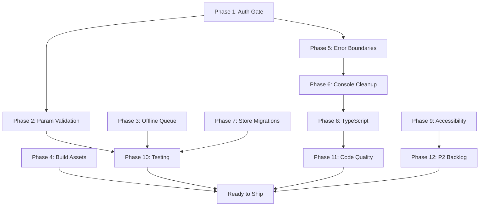

# Mobile Production Readiness Fix Plan

Ordered by risk reduction. Each phase builds on the previous one. Within each phase, tasks are parallelizable.

---

## Phase 1: Security -- Auth Gate and Deep Link Hardening (P0)

The most dangerous vulnerability: deep links and direct navigation can bypass authentication entirely.

### 1a. Add auth guard to deep link handler

In [hooks/useDeepLinking.ts](mobile/hooks/useDeepLinking.ts), the `handleUrl()` function (line 196) calls `router.push()` without checking auth state. Fix:

- Import `useAuth` from `AuthContext`
- Define a `PROTECTED_ROUTES` set (verdict-iq, strategy-iq, worksheet, deal-maker, deal-gap, price-intel, portfolio, photos, rehab, billing, profile)
- In `handleUrl()`, check if `route.pathname` is in `PROTECTED_ROUTES` and `!isAuthenticated` -- if so, redirect to `/auth/login` with a `returnTo` param encoding the original route
- On the login screen ([app/auth/login.tsx](mobile/app/auth/login.tsx)), read `returnTo` from params and navigate there after successful login instead of always going to home

### 1b. Add auth guard to modal stack screens

In [app/_layout.tsx](mobile/app/_layout.tsx), the `AppContent` component (line 148) renders the Stack without protecting modal routes. Fix:

- Create a `useAuthGate()` hook or inline logic in `AppContent` that listens to route changes
- For protected stack screens (verdict-iq, strategy-iq, worksheet, deal-maker, deal-gap, price-intel, portfolio/[id], billing, profile), redirect to `/auth/login` if `!isAuthenticated && !isLoading`
- Pattern: use Expo Router's `useSegments()` + `useRouter()` in `AppContent` to detect protected routes and `router.replace('/auth/login')` -- similar to the existing pattern in [(tabs)/_layout.tsx](mobile/app/(tabs)/_layout.tsx) lines 15-19

### 1c. Add URL host validation

In [hooks/useDeepLinking.ts](mobile/hooks/useDeepLinking.ts), `parseDeepLink()` (line 60) accepts any URL. Fix:

- After parsing with `ExpoLinking.parse(url)`, validate that `parsed.hostname` is either `null` (custom scheme), `dealgapiq.com`, or `www.dealgapiq.com`
- Reject all other hosts by returning `null`

---

## Phase 2: Crash Prevention -- Route Param Validation (P0)

All 13 dynamic routes use `useLocalSearchParams()` without validation. A malformed deep link or navigation bug will crash the app.

### 2a. Create a shared `useValidatedParams()` hook

Create a new utility hook in [hooks/useValidatedParams.ts](mobile/hooks/useValidatedParams.ts):

```typescript
export function useValidatedAddressParam(): { address: string; isValid: boolean } {
  const { address } = useLocalSearchParams<{ address: string }>();
  const decoded = address ? decodeURIComponent(address) : '';
  const isValid = decoded.length > 0 && decoded.length < 500;
  return { address: decoded, isValid };
}
```

Similar helpers for `strategy` (validate against known strategy IDs), `id` (non-empty string), `zpid` (non-empty string), and `token` (non-empty string, min length).

### 2b. Apply to all dynamic routes

Add validation at the top of each screen component. If `!isValid`, show a "Property not found" or "Invalid link" error state and a "Go Home" button. Apply to:

- `verdict-iq/[address].tsx` (line 251)
- `strategy-iq/[address].tsx` (line 266)
- `deal-maker/[address].tsx` (line 18)
- `deal-gap/[address].tsx` (line 40)
- `analyzing/[address].tsx` (line 25)
- `property-details/[address].tsx` (line 17)
- `price-intel/[address].tsx` (line 77)
- `photos/[zpid].tsx` (line 49)
- `worksheet/[strategy].tsx` (line 725)
- `portfolio/[id].tsx` (line 45)
- `auth/reset-password.tsx` (line 42)
- `auth/verify-email.tsx` (line 20)
- `learn/[strategy].tsx` (line 219)

---

## Phase 3: Offline Queue Robustness (P0 + P1)

### 3a. Add max retry limit and exponential backoff

In [services/syncManager.ts](mobile/services/syncManager.ts), `processOfflineQueue()` (line 361):

- Add `MAX_ATTEMPTS = 5` constant
- In the queue query (line 372), add `WHERE attempts < 5` to skip exhausted items
- Replace the linear retry with exponential backoff: on failure, set `next_retry_at = now + (2^attempts * 1000)` and filter by `next_retry_at < now` in the SELECT
- Add a `dead_letter_queue` table or a `status = 'failed'` column for items exceeding max attempts
- This requires a schema migration in [database/schema.ts](mobile/database/schema.ts) (bump to v4)

### 3b. Add transaction safety to sync operations

Wrap batch operations in SQLite transactions. In `syncSavedProperties()` (line 107), `syncSearchHistory()` (line 189), `syncDocuments()` (line 248), `syncLOIHistory()` (line 306):

- Use `db.execAsync('BEGIN TRANSACTION')` before the batch
- `db.execAsync('COMMIT')` on success
- `db.execAsync('ROLLBACK')` in the catch block
- This prevents partial writes if the app crashes or network drops mid-sync

### 3c. Add queue overflow protection

In `processOfflineQueue()` (line 361), add monitoring:

- Log a warning (Sentry breadcrumb) if queue size exceeds 200 items
- Add a `getQueueSize()` export for UI display (offline banner could show "X changes pending")
- Cap queue at 1000 items by dropping the oldest non-critical items on insert

---

## Phase 4: Build & Release Assets (P0)

### 4a. Generate production app icons

Current icons in [assets/](mobile/assets/) are 258x258. Required:

- Generate `icon.png` at 1024x1024 (iOS App Store requires this exact size)
- Generate `adaptive-icon.png` at 1024x1024 (Android foreground layer)
- Generate `splash.png` at a suitable high resolution
- User must provide or approve the source artwork -- the existing 258x258 can be upscaled or a vector source used

### 4b. Replace EAS submit placeholders

In [eas.json](mobile/eas.json) lines 105-107, replace:

- `APPLE_ID_PLACEHOLDER` with actual Apple ID email
- `ASC_APP_ID_PLACEHOLDER` with App Store Connect app ID
- `APPLE_TEAM_ID_PLACEHOLDER` with Apple Developer Team ID

These are account-specific values that must come from the developer.

### 4c. Prepare app store metadata

- Complete Android Data Safety form in Google Play Console
- Prepare app store screenshots (minimum 3 per device size)
- Verify `google-services-key.json` is configured in EAS secrets

---

## Phase 5: Error Boundary Coverage (P1)

### 5a. Add ErrorBoundary exports to all screens

The pattern is established in [verdict-iq/[address].tsx](mobile/app/verdict-iq/[address].tsx) lines 27-28:

```typescript
import { ScreenErrorFallback as ErrorBoundary } from '../../components/ScreenErrorFallback';
export { ErrorBoundary };
```

Add this two-line export to every screen file missing it (~20 screens):

- `(tabs)/scan.tsx`, `(tabs)/history.tsx`, `(tabs)/portfolio.tsx`, `(tabs)/dashboard.tsx`, `(tabs)/settings.tsx`, `(tabs)/map.tsx`
- `property-details/[address].tsx`, `photos/[zpid].tsx`, `portfolio/[id].tsx`
- `search-history/index.tsx`, `search.tsx`, `billing.tsx`, `profile/index.tsx`
- `auth/login.tsx`, `auth/register.tsx`, `auth/forgot-password.tsx`, `auth/reset-password.tsx`, `auth/verify-email.tsx`
- `onboarding/index.tsx`, `learn/[strategy].tsx`, `national-averages/index.tsx`, `rehab/index.tsx`, `help.tsx`, `privacy.tsx`, `terms.tsx`

### 5b. Add error state UI to data-fetching screens

Screens that fetch data but lack error UI should show an inline error card with retry. Apply to:

- `(tabs)/scan.tsx` -- show error banner if camera/scan fails
- `(tabs)/portfolio.tsx` -- show error state with retry
- `(tabs)/settings.tsx` -- show error on profile load failure
- `deal-maker/[address].tsx` -- show error from `useDealMakerBackendCalc`
- `property-details/[address].tsx` -- show error with retry
- `search-history/index.tsx` -- show error with retry
- `profile/index.tsx` -- show error with retry

---

## Phase 6: Production Console Cleanup (P1)

### 6a. Guard or remove unguarded console statements

Wrap all production `console.log` calls with `__DEV__` guards or remove them:

- `app/analyzing/[address].tsx:42` -- remove or guard
- `app/property-details/[address].tsx:78,83,88` -- remove (these are stub `console.log('Save property')` placeholders)
- `hooks/usePropertyScan.ts:154,195,213,316` -- guard with `__DEV__`

Leave `console.error`/`console.warn` in error handlers (these are useful for production debugging via Sentry breadcrumbs).

---

## Phase 7: State Management Hardening (P1)

### 7a. Add migrations to dealMakerStore and worksheetStore

[stores/dealMakerStore.ts](mobile/stores/dealMakerStore.ts) (line 231) and [stores/worksheetStore.ts](mobile/stores/worksheetStore.ts) (line 349) both have `version: 1` but no `migrate` function. Follow the pattern from [stores/assumptionsStore.ts](mobile/stores/assumptionsStore.ts) line 291:

```typescript
migrate: (persistedState: unknown, version: number) => {
  const state = persistedState as DealMakerState;
  // Version 0 → 1: no-op (initial schema)
  return state;
},
```

This is a no-op for now but establishes the migration infrastructure so future schema changes don't cause silent data loss.

### 7b. Add version and migration to propertyStore

[stores/propertyStore.ts](mobile/stores/propertyStore.ts) (line 110) has no `version` at all. Add `version: 1` and a no-op migration.

### 7c. Add granular selectors to all stores

Currently only `propertyStore` exports a selector (`useRecentSearches` at line 119). Add selectors for commonly accessed slices in:

- `assumptionsStore.ts` -- `useAssumptionsByStrategy(strategy)`, `useOperatingAssumptions()`
- `dealMakerStore.ts` -- already has `useDealMakerDerived` and `useDealMakerReady` (lines 242-299), these are good
- `worksheetStore.ts` -- already has `useWorksheetDerived` (line 368), add `useWorksheetInputs()`, `useWorksheetCalculating()`
- `uiStore.ts` -- add selectors for individual UI flags

---

## Phase 8: TypeScript Strictness (P1)

### 8a. Replace `catch (err: any)` with proper error types

25+ instances across 18 files. Replace with:

```typescript
// For API calls
catch (err: unknown) {
  const message = err instanceof Error ? err.message : 'Unknown error';
  // or for Axios: import { isAxiosError } from 'axios';
}
```

Priority files (most instances):

- `services/syncManager.ts` (12 instances)
- `context/AuthContext.tsx` (3 instances)
- `app/profile/index.tsx` (5 instances)
- `app/portfolio/[id].tsx` (3 instances)

### 8b. Replace `theme: any` patterns

In `app/terms.tsx:185,194` and `app/privacy.tsx:165,174`, replace `theme: any` with the proper theme type from [context/ThemeContext.tsx](mobile/context/ThemeContext.tsx).

### 8c. Break circular dependency

`services/analytics.ts` imports `validatePropertyResponse` from `hooks/usePropertyData.ts`. Extract `finiteOrNull()` and `validatePropertyResponse()` into a new file `utils/validation.ts`, then import from there in both files.

---

## Phase 9: Accessibility (P1)

### 9a. Audit and enforce minimum touch targets

Create a shared `TouchTarget` component or add a global style mixin ensuring all interactive elements meet:

- iOS: 44x44pt minimum
- Android: 48x48dp minimum

Apply to: scanner controls, slider thumbs, small icon buttons, and list item action buttons.

### 9b. Add accessibilityLabel to underserved screens

Priority screens with limited accessibility coverage:

- `app/onboarding/index.tsx`
- `app/privacy.tsx`, `app/terms.tsx`
- `app/learn/[strategy].tsx`
- `components/scanner/*` (camera controls)
- `components/analytics/MetricsAccordion.tsx`

### 9c. Add accessibilityLiveRegion for dynamic content

On screens where data loads asynchronously (verdict-iq, strategy-iq, deal-gap), add `accessibilityLiveRegion="polite"` to the container that changes between loading/error/data states so screen readers announce updates.

---

## Phase 10: Testing (P1)

### 10a. Auth flow tests

Create `__tests__/services/authService.test.ts`:

- Test login, token storage, 401 refresh, logout
- Test mutex behavior (concurrent 401s share one refresh)
- Mock SecureStore and axios

### 10b. Deep link parsing tests

Create `__tests__/hooks/useDeepLinking.test.ts`:

- Test all route mappings from the doc comment (lines 1-21)
- Test address sanitization (null bytes, HTML tags, length limits)
- Test invalid URLs return null
- Test host validation (after Phase 1c fix)

### 10c. Offline queue tests

Create `__tests__/services/syncManager.test.ts`:

- Test queue processing with success and failure
- Test max retry behavior (after Phase 3a fix)
- Test offline detection
- Mock SQLite database

### 10d. Zustand store tests

Create `__tests__/stores/assumptionsStore.test.ts`:

- Test migration v0 → v1 → v2
- Test default values
- Test update/reset actions

Create `__tests__/stores/dealMakerStore.test.ts` and `worksheetStore.test.ts`:

- Test load, update, save flows
- Test computed helpers (`getDealGap`, `getCapRate`, etc.)

### 10e. usePropertyData tests

Create `__tests__/hooks/usePropertyData.test.ts`:

- Test `finiteOrNull()` with NaN, Infinity, null, undefined, valid numbers
- Test `validatePropertyResponse()` sanitizes all expected fields
- Test cache key matches `['property-search', address]`

---

## Phase 11: Code Quality Cleanup (P2)

### 11a. Remove/implement TODO comments

- `services/propertyDetailsService.ts:123` and `services/analytics.ts:411` -- both are "Backend Needed" for City/State endpoints; add a code comment explaining the workaround or file a tracked issue
- `app/property-details/[address].tsx:79,84` -- implement save/share or remove the placeholders

### 11b. Add React.memo to pure list components

Wrap in `React.memo`:

- `components/property/PropertyCard.tsx`
- `components/scanner/PropertyCandidateSheet.tsx`

### 11c. Standardize on expo-image

Replace `Image` from `react-native` with `Image` from `expo-image` in components that render remote images. This gives automatic caching, blurhash placeholders, and progressive loading.

### 11d. Replace FlatList with FlashList in PropertyDetailsScreen

In `components/property/PropertyDetailsScreen.tsx:23`, swap `FlatList` for `FlashList` with `estimatedItemSize` prop.

---

## Phase 12: Remaining P2 Items

- Add retry button to `OfflineBanner` component
- Add `getItemLayout` to FlashList instances where item heights are fixed
- Add snapshot tests for critical UI components (VerdictIQ, StrategyIQ, DealMaker)
- Verify ATS is not disabled in production builds (`app.config.js:61-67`)
- Test push notification registration on both platforms
- Add queue size display to settings/debug screen

---

## Dependency Graph




Phases 1-4 are parallelizable (P0s). Phases 5-9 are parallelizable (P1s). Phases 10-12 depend on earlier phases being complete.