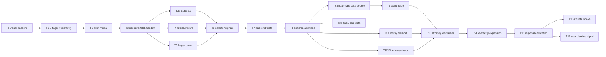

# Three Paths — Implementation Plan (Cursor handoff)

A self-contained implementation plan for the **Three Paths** feature in DealGapIQ. Pick this up cold — every section below is enough context for an agent or engineer to start work without prior conversation.

---

## 1. Product context

DealGapIQ is a real-estate investment SaaS that scores any property's Deal Gap (the % discount needed from list price to make the deal cash-flow at standard 20%-down / 6.5% / 30-yr financing). When the gap is negative ("you'd need to negotiate the price down to make this work"), beginner users churn — they assume there are no deals.

**Three Paths** turns every negative-gap property into three actionable, pre-computed alternative deal structures. Each structure closes the gap on its own using a different lever — price, capital stack, financing structure, income, or strategy. The user always sees a path forward; they never see a dead end.

**Key UX principle (do not violate):** the accurate Deal Gap % stays visible as the credibility/transparency layer. A motivating headline ("Potential Deal · structure makes it work") sits above it. Same competitive-positioning playbook as foreclosure.com vs. Attom — reshape the headline number, keep the accurate one for transparency.

**Competitive moat:** foreclosure.com surfaces only properties already discounted at auction; Attom and Datatree expose raw public-records data and leave synthesis to the user; mainstream MLS-derived tools (Redfin, Zillow, Realtor.com) end the conversation at "list price vs. estimate." None of them produce a per-property, structure-aware recommendation that turns a marginal listing into an actionable deal. Three Paths is category-defining because it is the synthesis layer — the answer to "so what do I do about this property?" — not another data feed.

---

## 2. What's already built (do not re-implement)

### Phase 0 — Motivating chart label (frontend-only)
- **Where:** `frontend/src/components/iq-verdict/types.ts`, lines around 259–451.
- **What:** every `DealGapTier` now has `motivatingLabel` and `motivatingSubtitle` fields. Six rungs: Cash-Flow Deal → Negotiable Deal → Near Deal → Potential Deal → Structured Deal → Reset Deal. Every property lands on one rung; there is no "Not a Deal" outcome.
- **Render site:** `frontend/src/app/verdict/page.tsx` around line 1699. The motivating label is the hero; the existing `−21% Deal Gap` and `Wide Negative Gap` chip stay below as the precision/credibility line.

### Phase 1 — MVP backend module + 3 templates + narrative
- **New module:** `backend/app/services/deal_structures/`
  - `context.py` — `StructureContext` (frozen dataclass holding all baseline inputs and computed properties: `baseline_loan_amount`, `baseline_monthly_pi`, `baseline_monthly_cash_flow`, `baseline_cash_required`).
  - `formatting.py` — `fmt_money`, `fmt_money_precise`, `fmt_pct_delta`, `fmt_money_delta`, `fmt_monthly`. Use these for all card/narrative copy — do not roll your own.
  - `templates/__init__.py` — exposes `ALL_TEMPLATES` list. Add new templates here.
  - `templates/price_negotiation.py` — solves to Target Buy.
  - `templates/seller_second_zero_balloon.py` — seller carries a 2nd at 0% with 5-yr balloon.
  - `templates/rent_uplift.py` — rent verification / light uplift.
  - `selector.py` — `select_three_paths(ctx)` runs all templates, sorts by `ranking_score` desc, picks 3 from different families, guarantees at least one non-price option.
  - `narrative.py` — generates 5th-grade walkthrough; position-aware lead-ins ("One way", "Another way", "A third way").
  - `engine.py` — `compute_deal_structures(ctx)` is the public entrypoint. Returns empty `DealStructuresPayload` if gap is non-negative.
- **New schema:** `backend/app/schemas/deal_structures.py` — `StructureLever`, `DealStructure`, `DealStructuresPayload`. Camel-case alias generator already configured.
- **Wired into the verdict response:**
  - `IQVerdictResponse.deal_structures` field added in `backend/app/schemas/analytics.py`.
  - `iq_verdict_service.py` builds a `StructureContext` after computing `deal_gap_pct` and calls the engine. The payload attaches to the response only when `has_paths=True`.
- **Frontend components:**
  - `frontend/src/components/iq-verdict/ThreePathsPanel.tsx` — responsive grid of cards.
  - `frontend/src/components/iq-verdict/DealStructuresNarrative.tsx` — narrative panel.
  - `VerdictGapGuidance.tsx` — renders narrative + cards when payload is present; falls back to legacy lever buttons otherwise.
  - Verdict page response normalization (`page.tsx` ~line 767) handles snake_case ↔ camelCase.

### What was verified

- Backend module produces correct output via direct synthetic test (3 paths, narrative reads naturally).
- Frontend typechecks clean with `npx tsc --noEmit`.
- **Not yet verified visually in browser** — local Postgres was not running. Phase 2 starts with this verification.

---

## 3. How to run the project

### Backend
- Python 3.12 venv expected. The existing venv lives at `/Users/bradgeisen/IQ-Data/dealscope/backend/venv` and works against the worktree code.
- Postgres required — the verdict endpoint reads assumptions from the DB via `assumption_resolver`. Spin up local Postgres before running the verdict flow end-to-end.
- Start: `cd backend && source <venv>/bin/activate && uvicorn app.main:app --reload --port 8000`.
- Ignore startup warnings about missing API keys (RentCast, Stripe, etc.) — not needed for Three Paths.
- Verdict endpoint: `POST /api/v1/analysis/verdict` with `IQVerdictInput` payload. Response now includes `deal_structures` (or `null` when gap ≥ 0).

### Frontend
- `cd frontend && npm install` (already done in this worktree).
- `npm run dev` (Next.js + Turbopack on port 3000; if 3000 is busy, set `autoPort: true` in `.claude/launch.json`).
- Verdict page: `/verdict?address=...`.

### Quick synthetic test of the engine without DB
```python
from app.services.deal_structures import compute_deal_structures
from app.services.deal_structures.context import StructureContext

ctx = StructureContext(
    list_price=410000, target_buy_price=360000, income_value=380000, deal_gap_pct=12.2,
    monthly_rent=2400, property_taxes_annual=4800, insurance_annual=1500,
    down_payment_pct=0.20, interest_rate=0.065, loan_term_years=30, closing_costs_pct=0.03,
    vacancy_rate=0.05, maintenance_pct=0.05, management_pct=0.08, capex_pct=0.05,
    utilities_annual=0, other_annual_expenses=0,
    is_listed=True, days_on_market=75, is_fsbo=False,
    is_foreclosure=False, is_bank_owned=False, market_temperature='cold',
)
result = compute_deal_structures(ctx)
print(result.has_paths, len(result.paths))
```
Expected: 3 paths, narrative with 5 paragraphs (opener + 3 paths + closer).

---

## 4. Code conventions (must follow)

- **Backend owns all calculations.** Never put financial formulas in the frontend. The frontend renders pre-computed numbers. The `DealStructure` payload includes formatted strings (`beforeLabel`, `afterLabel`) so the frontend never re-computes.
- **Pure functions for templates.** Each template's `solve(ctx)` is a pure function of `StructureContext`. No I/O, no DB reads, no `datetime.now()`. The selector / engine are also pure.
- **Camel-case at the API boundary.** Pydantic schemas use `_to_camel` alias generator. TypeScript consumers expect `monthlySavings`, not `monthly_savings`. The frontend response normalization handles both for safety.
- **Copy doctrine — cards:**
  - Headline ≤ 60 chars, declarative, never advisory ("Negotiate to $385K", not "You should...").
  - Levers: `before → after` with optional delta. Use `fmt_money` for compact, `fmt_money_precise` for full dollar amounts.
  - Caveat: one short honest line. Do not hide risks; do not dwell on them.
  - **Why-this-card line:** every card carries one short sentence above the levers explaining why this template was selected for *this specific property* (e.g., "Shown because the property has been listed 92 days" or "Shown because the seller likely has a sub-4% existing loan from 2021"). This builds trust and differentiates DealGapIQ from random-suggestion competitors. Implementation: each template returns a `selection_reason: str`; add the field to `DealStructure` in `backend/app/schemas/deal_structures.py` and render above the levers in `ThreePathsPanel.tsx`.
- **Copy doctrine — narrative:**
  - 5th-grade reading level. Short sentences. No jargon ("amortize," "leverage," "DSCR," "NOI," "subject to," "cash-on-cash," "cap rate" are banned in narrative). For Sub2 use "take over the seller's loan" — the "Sub2" abbreviation is allowed only in the card family chip, never in narrative prose.
  - Never "you should." Use "people do," "another way is."
  - Concrete dollar numbers (same as the cards — same source of truth).
  - Always end with the closer: *"Any one of these makes the deal work. You don't need all three."*
  - **Worked examples (one paragraph each, for engineer reference — voice and reading-level target):**
    - **Sub2 (T3a):** "Another way is to take over the seller's loan. They got it in 2021 at about 3.1%, so the monthly payment is way lower than a new loan today. You bring about $58,000 in cash to cover the equity they have, and you keep paying their loan in their name. That drops your monthly cost by about $640 and the deal cash-flows from day one."
    - **Rate buydown (T4):** "One way is to ask the seller to pay for a 2-1 rate buydown. That costs them about $7,200, but it cuts your interest rate by 2% in year one and 1% in year two. Your monthly payment is $410 lower in year one. By year three you raise rents or refinance and the deal still works."
    - **Larger down (T5):** "A third way is to put 35% down instead of 20%. That's about $51,000 more cash at closing. But your monthly mortgage drops by about $480, which is enough to cash-flow. People do this when they have cash sitting at 4% in a savings account and want it working harder."
    - **Assumable (T9):** "One way is to take over the seller's old FHA loan at 3.4%. The bank has to approve it, which takes about 60 to 90 days, but the rate is so much lower than today's 6.5% that it saves you about $760 a month. Over the rest of the loan, that's worth roughly $95,000 in today's dollars."
    - **Morby Method (T10):** "Another way combines two moves. You take over the seller's existing loan, and they carry a small second loan for the rest of their equity at 5% for 15 years. You bring less cash to closing, your blended monthly payment is about $580 lower, and the seller gets monthly checks from you instead of a big tax bill."
    - **FHA house-hack (T12):** "A third way is to live in the property for at least one year and rent the other rooms. With FHA you only put 3.5% down — about $14,000 here. Rent from the spare bedrooms covers most of your mortgage, so you live almost free. After a year you can move out and keep the property as a rental."
- **Mobile UX doctrine:**
  - Mobile-first stack order: motivating label → top-ranked card → narrative panel → cards 2 and 3 → footer disclaimers. The first card must be visible above the fold on a 375px-wide viewport so users see one concrete actionable structure before scrolling.
  - Three cards collapse to a single vertical column under 768px; no horizontal scroll, no card carousels (carousels hide options and tank engagement).
  - Card height stays under 480px on mobile so the narrative remains visible after a single scroll.
  - Respect `prefers-reduced-motion`: any card-entry animation must be `motion-safe:` only; no parallax or auto-scroll.
- **Diversity rule:** the selector must never return three structures from the same family. Hard rule in `selector.py`.
- **Honest gating:** a template returns `None` (or `DealStructure` with `monthly_savings <= 0`) when it cannot close the gap. Never pad with weak structures. If fewer than 3 templates fire, the panel shows fewer than 3 cards.

---

## 5. Phase 2 — V2: make the MVP feel finished (~1 week)

**Phase goal:** turn the working MVP into a polished feature users adopt. Adds Sub2, rate buydown, and larger-down templates; replaces the alert with a real modal; pre-loads scenarios into Strategy.

### T0 — Visual baseline verification

**Effort:** S
**Scope:** spin up local Postgres + backend + frontend; load the verdict page for a property whose Deal Gap is between −5% and −20%; confirm the new components render correctly.

**Acceptance criteria:**
- Screenshot showing the motivating label ("Potential Deal · structure makes it work") above the existing Deal Gap header.
- Screenshot of the narrative panel with 5 paragraphs.
- Screenshot of three cards rendered in the responsive grid — card 1 is "Creative finance" (highest ranking), card 2 is "Bigger ask" (price), card 3 is "Significant uplift" (income).
- Console log clean of new errors related to Three Paths.

**Why first:** subsequent phases all build on the rendered baseline. Catch layout, copy, or wiring bugs now.

---

### T0.5 — Feature flags + telemetry foundation

**Effort:** S
**Scope:** ship per-template kill switches and the three core analytics events *before* any new template lands. Without this, we cannot measure the lift from Three Paths versus the legacy lever buttons, and we have no safe rollback if a template produces a bad card on a real property.

**Backend:**
- New constant `STRUCTURE_TEMPLATE_FLAGS: dict[str, bool]` in `backend/app/core/defaults.py` (keys are template `id` strings — `price-negotiation`, `seller-second-zero-balloon`, `rent-uplift`, plus future `sub2`, `rate-buydown`, `larger-down`, etc.; default all `True`).
- Wire into `backend/app/services/deal_structures/engine.py :: compute_deal_structures()` — engine filters `ALL_TEMPLATES` by flag before invoking `selector.select_three_paths`. Disabled templates never execute, so a bad template can be killed in defaults without redeploy.
- Expose flag overrides through the existing admin defaults endpoint (`backend/app/routers/defaults.py`) so support can flip a flag in seconds.

**Frontend telemetry (the three events from the original V4 / T14 — promoted to ship in v1):**
- `three_paths_rendered` — fired from `VerdictGapGuidance.tsx` once per verdict view when the panel mounts. Properties: `path_count`, `families: string[]`, `top_family`, `deal_gap_pct`, `state`.
- `path_pitch_opened` — fired from the pitch modal (shipping in T1) on open. Properties: `structure_id`, `family`.
- `path_opened_in_strategy` — fired from the scenario handoff util (shipping in T2) before navigation. Properties: `structure_id`, `family`.
- Wire through `frontend/src/lib/eventTracking.ts` — `trackEvent(name, props)` wraps **Vercel Analytics** (`@vercel/analytics`) and respects cookie consent. Map the three event names to `trackEvent` (platform decision: section 12).

**Acceptance criteria:**
- Setting `STRUCTURE_TEMPLATE_FLAGS["price-negotiation"] = False` in admin defaults makes the price card disappear from the verdict response on the next request, with no redeploy. Verified with one before/after API call.
- All three events appear in the analytics sink (or the local console when no sink is configured) with the documented properties.
- Documented in `docs/DEFAULTS_ARCHITECTURE.md` — one short subsection on `STRUCTURE_TEMPLATE_FLAGS`.

**Why before T1:** T1 (pitch modal) is the first user-visible change after the baseline; we want telemetry firing the moment the modal ships so the pitch-open conversion rate is captured from day one. Building telemetry retroactively in V4 means flying blind through the most important launch window.

---

### T1 — Pitch modal component

**Effort:** S
**Scope:** replace the `window.alert(s.pitchScript)` placeholder in `frontend/src/app/verdict/page.tsx` (~line 1775) with a styled modal.

**Files:**
- New: `frontend/src/components/iq-verdict/PitchScriptModal.tsx`
- Modified: `frontend/src/app/verdict/page.tsx` — replace the alert with state-driven modal.

**Implementation:**
```tsx
interface PitchScriptModalProps {
  structure: DealStructure | null
  onClose: () => void
}
```
- ESC and backdrop click close it.
- "Copy to clipboard" button uses `navigator.clipboard.writeText`.
- Headline = structure name, body = `pitchScript`, footer has Copy + Close buttons.
- Style with existing CSS variables (`var(--surface-elevated)`, `var(--text-heading)`, `var(--accent-sky)`).

**Product decision (section 12):** **Copy to clipboard only** in v1 — do not add “share via email” or other share channels for the pitch modal.

**Acceptance criteria:**
- Clicking "How to pitch this" on any card opens the modal with that structure's script.
- Copy button works on Chrome desktop and mobile Safari.
- ESC closes; backdrop click closes; modal is keyboard-accessible.

---

### T2 — "Open in Strategy" pre-loads the scenario (URL-based handoff)

**Effort:** M
**Scope:** when the user clicks "Open in Strategy" on a card, the Strategy worksheet opens already populated with that structure's lever values. Transport is a versioned, URL-encoded payload — not raw localStorage — so scenarios are shareable, survive new-tab opens, and degrade safely on schema mismatch.

**Why URL over localStorage:** localStorage as a primary transport has three failure modes — (1) a race where opening Strategy in a new tab via cmd-click runs before the write resolves, (2) silent stale-state bugs when the user bounces between cards (the "stale localStorage" caveat is already in the original acceptance criteria — that is a tell), and (3) opaque cross-page coupling that makes regressions invisible until they hit production. A URL query param is debuggable, shareable (free virality when an investor pastes a link to their partner), and safe across tabs. localStorage stays as a *secondary* cache only, for the "page refresh recovery" case.

**Backend:**
- Extend `DealStructure` schema in `backend/app/schemas/deal_structures.py`:
  ```python
  pre_loaded_record: dict = Field(default_factory=dict, description="Partial DealMakerRecord-shaped dict")
  ```
- Each template populates `pre_loaded_record` with only the levers it changed:
  - `price_negotiation.py` → `{"custom_purchase_price": new_price}`
  - `seller_second_zero_balloon.py` → `{"seller_carry_amount": chosen_second, "seller_carry_rate": 0.0, "seller_carry_term_years": 5}` (Note: `seller_carry_*` fields require T8 schema additions; until T8 lands, store under a `pending_extras: dict` field on `pre_loaded_record`.)
  - `rent_uplift.py` → `{"custom_rent_estimate": new_rent}`

**Frontend:**
- New: `frontend/src/lib/dealStructures/scenarioPayload.ts`
  ```ts
  export interface ScenarioPayloadV1 {
    v: 1
    structureId: string
    family: string
    levers: Partial<DealMakerRecord>
  }
  export function encodeScenario(p: ScenarioPayloadV1): string  // base64url(JSON.stringify(p))
  export function decodeScenario(raw: string): ScenarioPayloadV1 | null  // null on parse error or version mismatch
  ```
  Use `base64url` (URL-safe alphabet, no padding) to keep links clean. Cap encoded length at 2KB and log a warning if exceeded — payloads are small partial records and should never approach this.
- New: `frontend/src/lib/dealStructures/loadScenario.ts` — takes a `DealStructure`, builds the `ScenarioPayloadV1`, returns `/strategy?scenario=<encoded>`. Also writes a `lastAppliedScenario` localStorage entry as a refresh-durability fallback only.
- Strategy worksheet: on mount, read `searchParams.get('scenario')`, call `decodeScenario`, apply via existing form-state setter, then strip the query param via `router.replace(/strategy)` so the URL stays clean and refresh does not re-apply twice. On version mismatch (`decodeScenario` returns `null`), fall back to `lastAppliedScenario` from localStorage; if both fail, no-op (scenario load is best-effort, never blocks Strategy).
- Update `onOpenStructureInStrategy` in `frontend/src/app/verdict/page.tsx` (~line 1772) to call `loadScenario(structure)` and navigate to the returned URL. Fire the `path_opened_in_strategy` telemetry event (from T0.5) immediately before navigation.

**Product decision (section 12):** **Auto-save each opened path as a named scenario** so users can return later. When the user lands on Strategy from a path, also persist a saved scenario with a human label, e.g. `Path 1 — Negotiate`, `Path 2 — Seller carry`, `Path 3 — Rent uplift` (derive label from path index + structure `family_label` or `headline` truncated). Reuse the Strategy worksheet’s existing saved-scenario / snapshot mechanism if one exists; otherwise add a small `savedThreePathScenarios` list in localStorage (or align with Deal Maker saved deals) with `{ label, scenarioPayload, structureId, savedAt }`, surfaced in Strategy UI so users can reopen without returning to Verdict.

**Acceptance criteria:**
- Clicking "Open in Strategy" on the price-negotiation card lands the user on Strategy with the lower price already populated.
- Cmd-click / middle-click "Open in Strategy" opens Strategy in a new tab with the scenario applied (URL-based transport works across tabs; localStorage version did not).
- The URL is shareable: copying it and opening in a different browser session produces the same Strategy state.
- Switching back to the verdict page and into a different card produces a different Strategy state (each navigation carries its own URL payload — no stale localStorage interference).
- A truncated or tampered `scenario` param falls back to `lastAppliedScenario`; if both are unusable, Strategy loads with no preload and no error toast.
- Works for all three MVP templates.
- After handoff, a **labeled saved scenario** appears in Strategy (or the designated list) so the user can reopen `Path N — …` without re-running Verdict.

**Dependency:** T0 — confirm Strategy form-state setter shape; T0.5 — `path_opened_in_strategy` event handler available.

---

### T3a — Subject-To (Sub2) template, v1 (no external data dependency)

**Effort:** M
**Scope:** add a fourth template that models taking over the seller's existing low-rate mortgage, using only data already available on the verdict request. High user impact — this is the most-recognized creative-finance pattern (Pace Morby).

**Why this is split from T3b:** there is no upstream source today for the seller's actual remaining loan balance or rate. RentCast and Zillow/AXESSO do not return mortgage-level data. Shipping Sub2 with hard requirements on those fields means it never fires in production. T3a uses transparent assumptions surfaced in the card itself; T3b (Phase 3) replaces the assumptions with real public-records data once an integration is signed.

**Files:**
- New: `backend/app/services/deal_structures/templates/sub2.py`.
- Modified: `backend/app/services/deal_structures/templates/__init__.py` — add to `ALL_TEMPLATES`.

**Required input data (already available or trivially derived):**
- Add to `IQVerdictInput` (`backend/app/schemas/analytics.py`):
  ```python
  estimated_purchase_year: int | None = Field(None, ge=1900, le=2100, description="Year the seller purchased the property; from MLS/Zillow last-sold date")
  estimated_purchase_price: float | None = Field(None, ge=0, description="Last recorded sale price; already available from Zillow/AXESSO")
  ```
- These fields exist in the Zillow/AXESSO response under `lastSoldDate` / `lastSoldPrice` — wire them through in `api_clients.py` `DataNormalizer` if not already mapped (low-effort adjacent work).
- Pass through `StructureContext`.

**Rate assumption (no external data — based on national 30-yr fixed averages by purchase year):**

| Year | Assumed rate |
|---|---|
| ≤2018 | 4.5% |
| 2019 | 4.2% |
| 2020 | 3.4% |
| 2021 | 3.1% |
| 2022 | 4.8% |
| 2023+ | skip template (no rate advantage vs. today's market) |

**Balance assumption (transparent heuristic):**
- Use `estimated_purchase_price` plus a national HPI-style appreciation curve (4% annual default; later refinable to per-state via the existing `INVESTOR_DISCOUNT_BRACKETS` plumbing in `iq_verdict_service.py`) to estimate appreciation since purchase.
- Assume the seller financed 80% of the original purchase price on a 30-year amortization at the year's rate; compute remaining balance via standard amortization formula at `(today − purchase_year)` years in.
- Equity = `current_estimated_value − remaining_balance`.

**Math:**
- Buyer pays full asking; takes over existing loan via Sub2 at the assumed rate; brings cash + optional seller carry for the equity gap.
- Solve for cash + seller-carry split such that buyer's monthly cost (existing P&I + carry P&I) is below baseline by enough to close the gap.
- Default: 80% of the equity gap is cash, 20% is seller-carry at 5% / 15-yr.
- If `estimated_purchase_year` is missing entirely, template returns `None` (no Sub2 card — never fabricate).

**Card copy template:**
- Headline: `Take over the seller's ~{rate}% loan`
- Family label: `Take over the loan`
- Realism label: `Lowest cost of capital`
- **Selection reason** (per the section-4 doctrine): `Shown because the seller likely bought in {year} when rates were ~{rate}%`
- Caveat: `Numbers assume the seller's original loan balance based on purchase year. Real balance may differ — confirm before making an offer. The bank can also technically call the loan due (due-on-sale clause); it's rare in practice but real. Most Sub2 deals use a land trust or LLC structure — covered in Strategy.`

**Selector signals:**
- Hard fire only when assumed rate < `interest_rate - 0.015` (existing loan is at least 1.5% cheaper than today's rate).
- Bonus +10 if `days_on_market > 60`. *(CALIBRATION PLACEHOLDER — see T6.)*
- Bonus +6 if `is_fsbo`. *(CALIBRATION PLACEHOLDER — see T6.)*
- Penalty −15 if `is_foreclosure or is_bank_owned` (banks/REOs don't carry paper).

**Acceptance criteria:**
- Property with `estimated_purchase_year=2021` returns a Sub2 card with realistic monthly savings vs. baseline.
- When DOM > 60 OR FSBO, Sub2 ranks at or above price negotiation.
- Caveat renders in the card and explicitly states the balance is an assumption.
- When `estimated_purchase_year` is missing, template returns `None` (no Sub2 card).
- Property bought in 2023+ → Sub2 returns `None` (no rate advantage).

---

### T3b — Subject-To with real public-records data (Phase 3, behind flag)

**Effort:** L
**Scope:** replace T3a's heuristic balance/rate with actual mortgage data from a public-records integration. Removes the assumption caveat; gives accurate numbers per property.

**Hard prerequisite:** named data integration partner. Candidates: BatchData, PropMix, ATTOM mortgage feed, DataTree. Selection involves contract negotiation, per-call cost modeling, and security review — none of which fit inside the engineering ticket. **This ticket cannot start until product/business signs a partner.** Tracked as a Phase 3 dependency below.

**Required input data (real, from the integration):**
- Add to `IQVerdictInput` (`backend/app/schemas/analytics.py`):
  ```python
  estimated_existing_loan_balance: float | None = Field(None, ge=0, description="Current mortgage balance from public records")
  estimated_existing_loan_rate: float | None = Field(None, ge=0, le=0.30, description="Actual rate of the seller's existing loan")
  ```

**Implementation:**
- In `sub2.py`, prefer real values when present; fall back to T3a heuristic when null.
- Update card caveat — when both real values are present, drop the "balance is an assumption" sentence; keep only the due-on-sale caveat.
- Update selection-reason to be specific: `Shown because the seller has ~$XK at {rate}% from {year}`.

**Feature flag:** `STRUCTURE_TEMPLATE_FLAGS["sub2-real-data"]` from T0.5 — wire so T3a always serves and T3b's enrichment is opt-in until accuracy is verified across ~100 sample properties.

**Acceptance criteria:**
- With real data present, card numbers match a manual spreadsheet calc within 1%.
- With real data absent, falls back to T3a output cleanly with no error.
- Telemetry distinguishes `sub2-heuristic` vs `sub2-real-data` selections so we can measure conversion lift from accuracy.

---

### T4 — 2-1 Rate Buydown template

**Effort:** S
**Scope:** seller pays for a 2-1 rate buydown — buyer's effective rate is 2% lower in year 1, 1% lower in year 2, then back to note rate.

**File:** new — `backend/app/services/deal_structures/templates/rate_buydown.py`.

**Math:**
- Year 1 rate = note_rate − 0.02; Year 2 rate = note_rate − 0.01; Year 3+ = note_rate.
- Compute Y1 P&I; if Y1 cash flow ≥ 0, the structure clears.
- Seller's cost ≈ (Y1 P&I difference + Y2 P&I difference) × 12 ≈ ~1.5% of loan amount. Display rounded.

**Card copy:**
- Headline: `Seller pays a 2-1 rate buydown ({cost})`
- Family: `financing`
- Family label: `Buy your runway`
- Realism: `New construction friendly`
- Caveat: `Returns to note rate in year 3 — plan to raise rents or refi by then.`

**Selector signals:**
- High realism on `days_on_market > 30`.
- Bonus on new construction (heuristic: if `IQVerdictInput.year_built` exists and is current year ± 2 — add this field if missing).

**Acceptance:** Three Paths returns this card on listed-with-DOM properties; card labels each year's rate explicitly; honest caveat renders.

---

### T5 — Larger Down Payment template

**Effort:** S
**Scope:** solve for the down-payment % (capped at 50%) needed to drop monthly P&I enough to close the gap. Fills out the `capital_stack` family for selector diversity.

**File:** new — `backend/app/services/deal_structures/templates/larger_down.py`.

**Math:** binary search down_pct in `[0.20, 0.50]` for the value where new P&I + opex ≤ monthly rent (after vacancy/expenses). If even 50% down doesn't close the gap, return `None`.

**Card copy:**
- Headline: `Put {pct}% down ({cash})`
- Family: `capital_stack`
- Realism: `Capital-heavy path`
- Caveat: `Higher cash outlay reduces cash-on-cash return — model both scenarios in Strategy.`

**Selector signals:** high realism on small gaps (< 8%); penalize on large gaps (cash requirement becomes implausible).

**Acceptance:** small-gap properties (< 10%) return this card; selector picks it as a non-price diversifier when price-negotiation isn't the highest-ranked.

---

### T6 — Selector ranking signal upgrades

**Effort:** S
**Scope:** tighten `selector.py` so realism scoring uses listing context cleanly.

**Changes:**
- Add `_apply_listing_signals(ctx, structure)` helper that adjusts `ranking_score` based on:
  - `is_foreclosure` or `is_bank_owned`: +5 to price-negotiation, −15 to all financing-family templates. *(CALIBRATION PLACEHOLDER)*
  - `is_fsbo`: +6 to financing family, +4 to price-negotiation. *(CALIBRATION PLACEHOLDER)*
  - `days_on_market` bands: 30–60 → +3, 60–90 → +6, 90–180 → +9, 180+ → +12 to all candidates. *(CALIBRATION PLACEHOLDER)*
  - `market_temperature == 'cold'`: +5 to financing family, +3 to price. *(CALIBRATION PLACEHOLDER)*

**Calibration note:** every numeric weight above ships as a v1 placeholder based on first-principles reasoning, not data. Document each weight in the source file with an inline `# CALIBRATION PLACEHOLDER — refine via A/B test (see T17 / T15)` comment so future engineers don't treat them as load-bearing constants. T17 (Phase 4) opens an A/B-test ticket to tune these from real `path_opened_in_strategy` conversion data; T15 (Phase 4) layers regional adjustments on top.

**Acceptance:** new unit tests in T7 verify ranking shifts under each signal combination, and assert that flipping any single weight by ±20% does not break test invariants (catches load-bearing weight regressions early).

---

### T7 — Backend test coverage

**Effort:** S
**Scope:** golden-file tests for the engine across representative properties.

**Files:**
- New: `backend/tests/test_deal_structures_engine.py` — fixtures for 5 properties (positive gap, small gap, medium gap, large gap, REO).
- New: `backend/tests/test_deal_structures_selector.py` — fixtures verifying ranking under hot/cold markets, FSBO, REO, varying DOM.

**Acceptance:**
- `pytest backend/tests/test_deal_structures*` passes.
- Golden snapshots cover headlines, summaries, narrative paragraphs.
- A new template can be added without breaking any fixture.

---

## 6. Phase 3 — V3: creative finance differentiation (~1.5 weeks)

**Phase goal:** add the named patterns users learn from real-estate influencers (Sub2 + seller carry combo = "Morby Method", assumable mortgages, FHA house-hack). This is what makes DealGapIQ category-of-one.

### T8 — DealMakerRecord schema additions

**Effort:** S
**Scope:** add fields the new templates need to write into the scenario record.

**File:** `backend/app/schemas/deal_maker.py`.

**Add (all nullable, default `None`):**
- `seller_carry_amount: float | None`
- `seller_carry_rate: float | None`
- `seller_carry_term_years: int | None`
- `seller_carry_balloon_years: int | None`
- `closing_cost_credit: float | None`
- `is_owner_occupied: bool | None`

**Migration:** if there's a DB-backed `DealMakerRecord` (via `SavedProperty.deal_maker_record` JSON), no schema migration needed since it's stored as JSON. If it's stored in columns, add nullable columns.

**Acceptance:** existing scenarios load unchanged; new fields round-trip correctly; T2's `pre_loaded_record` payloads can now use these.

**Dependency:** unblocks T9, T10. Also feeds T3b (real-data Sub2).

---

### T8.5 — Existing-loan-type data source (hard prerequisite for T9)

**Effort:** M (mostly non-engineering — partner selection, contract, security review)
**Scope:** identify and integrate a public-records data source that returns the seller's existing loan type (FHA / VA / USDA / conventional). Without this field populated for a meaningful share of properties, T9 (assumable) ships behind a flag that is never flipped on, which means it ships nothing.

**Deliverables:**
- **Partner selection memo:** evaluate BatchData, PropMix, ATTOM, DataTree on coverage (% of US properties with loan-type attribution), per-call cost, latency, and mortgage-feed freshness. Pick one. (This is product/business work; engineering owns the technical evaluation.)
- **Backend integration:** new `backend/app/services/api_clients/public_records_client.py` with the standard async client pattern matching `rentcast_client.py`. Caching via the existing Redis layer; degrade to `None` on timeout (never block verdict response).
- **Normalizer wiring:** map response fields into `normalized["existing_loan_type"]` and feed through `PropertyService` → `IQVerdictInput.existing_loan_type`.
- **Coverage report:** internal admin page or one-shot script that samples 1,000 random recent verdict requests and reports loan-type fill rate. Target ≥40% before merging T9 to main.

**Acceptance criteria:**
- Sample of 100 properties returns `existing_loan_type` populated for the projected share.
- Per-call cost is documented and within the agreed budget.
- Public-records call adds <300ms p95 latency to the verdict response (or runs async and degrades to `None`).
- Telemetry tracks fill rate so regressions are visible.

**This unblocks T9.** T9 acceptance criteria already include the feature flag — that flag stays `False` until T8.5 ships and the coverage report meets the 40% bar.

---

### T9 — Assumable Mortgage Match template

**Effort:** M
**Scope:** when the seller's existing loan is FHA / VA / USDA, surface an "Assumable" card. Math computes the present value of the rate spread.

**File:** new — `backend/app/services/deal_structures/templates/assumable.py`.

**Hard prerequisite:** T8.5 must ship and meet its coverage bar before this template is unflagged in production. Without real loan-type data the card never fires — shipping it behind a permanently-disabled flag is shipping nothing.

**Required input data:** add to `IQVerdictInput`:
```python
existing_loan_type: Literal["FHA", "VA", "USDA", "conventional", None] = None
```
Field is populated by the integration delivered in T8.5. Template is gated behind `STRUCTURE_TEMPLATE_FLAGS["assumable"]` (from T0.5) until coverage is verified.

**Math:**
- Buyer assumes the existing loan; brings cash + optional seller-carry 2nd for the equity gap.
- Compute PV of rate-spread savings: monthly savings × remaining-term annuity factor at note rate.
- Show this number as a large headline figure (`worth ~$95K in present value`).

**Card override:** when this card fires, override the selector to put it in **Path 1**, regardless of other rankings. The math is decisive.

**Caveat:** `Loan assumption takes 60–90 days for the bank's approval. Slower than a new mortgage. Worth the wait when the rate gap is this big.`

**Acceptance:** property with `existing_loan_type='FHA'` returns a card with PV computed from real annuity math; card slots into Path 1; feature flag toggles visibility.

---

### T10 — Morby Method combination card

**Effort:** M
**Scope:** when both Sub2 (T3) and a seller-carry template fire as feasible, replace them with a single named "Morby Method" card.

**Files:**
- New: `backend/app/services/deal_structures/templates/morby_method.py` — combination logic.
- Modified: `backend/app/services/deal_structures/selector.py` — add a post-selection pass that detects Sub2 + seller-carry pair and substitutes.

**Math:** combines Sub2 (take over existing loan) + seller-carry (for equity gap) — both already implemented separately. The combination card just renders both legs and labels the bundle.

**Card copy:**
- Headline: `The Morby Method — Sub2 + seller carry`
- Realism label: `Named pattern`
- Body: shows existing-loan takeover + seller-carry-for-equity in two sections.

**Narrative:** new branch in `narrative.py` for `id == 'morby-method'` — replaces the two paragraphs the absorbed templates would have produced.

**Acceptance:** property where both Sub2 and seller-carry independently fire returns 3 cards including "The Morby Method" (not two separate cards). Narrative reads cleanly with one Morby paragraph instead of two.

---

### T11 — Wraparound variant — QUARANTINED (do not ship until legal review)

**Status:** REMOVED FROM V3 SCOPE. Moved to the "Pending legal review" appendix at the end of this document.

**Why quarantined:**
- Wraparound mortgages create direct triggering events for Garn-St. Germain due-on-sale enforcement — legally distinct from Sub2 and harder to defend.
- Texas added a wrap-around lender licensing requirement in 2021 (SB 43); offering wrap math to TX users without state-specific compliance language could be construed as unlicensed lending facilitation.
- Burying wrap as a "Show wraparound version" toggle on the Sub2 card under-communicates the legal risk to users and to DealGapIQ — exactly the wrong direction for a product whose moat is trust.

**To unquarantine in a future phase:**
- Legal review with a real-estate attorney (not generic SaaS counsel).
- State-by-state allowlist; default OFF for all states.
- Standalone card (not a Sub2 toggle) with prominent disclaimer.
- Mandatory affiliate link to a wrap-licensed attorney before "Open in Strategy" enables.

Until those are in place, the Sub2 card stands alone. See appendix: "Pending legal review."

---

### T12 — FHA House-Hack template

**Effort:** M
**Scope:** strategy switch — 3.5% down + owner-occupy + count partial rent. Only fires for owner-occupy intent or 2-4 unit small multifamily.

**File:** new — `backend/app/services/deal_structures/templates/fha_house_hack.py`.

**Required input:** `is_owner_occupied: bool` and unit count (`bedrooms` is a proxy for bedrooms, but for multifamily we need `unit_count`. Add to `IQVerdictInput` if missing).

**Math:**
- 3.5% down, current FHA rate (use existing assumption + 0.005 spread for FHA), 30-yr.
- For SFH owner-occupy: assume rent from spare bedrooms (rough heuristic: `rent_per_bedroom = monthly_rent / bedrooms`; income = `(bedrooms - 1) * rent_per_bedroom`).
- For 2-4 unit: assume rent from non-owner-occupied units.
- Add MIP (Mortgage Insurance Premium) to monthly cost (~0.55% annual on FHA).

**Card copy:**
- Family: `strategy_switch`
- Family label: `House-hack`
- Caveat: `FHA requires you to live in the property for at least 1 year.`

**Acceptance:** small-multifamily properties surface this card; cash-required reflects 3.5% down + MIP.

---

### T13 — Find an attorney disclaimer

**Effort:** S
**Scope:** footer line on any Three Paths card whose family is `financing` or `strategy_switch`.

**Files:**
- Modified: `frontend/src/components/iq-verdict/ThreePathsPanel.tsx` — conditional disclaimer block.
- New: `frontend/src/app/legal/find-attorney/page.tsx` — static page (placeholder for now; affiliate link in T16).

**Copy:** `Get this contract reviewed by a creative-finance attorney → [Find one](/legal/find-attorney)`

**Acceptance:** disclaimer renders on Sub2, seller-2nd, wrap, Morby, FHA cards; not on price or rent cards.

---

## 7. Phase 4 — V4: polish, telemetry, monetization (optional, ~1 week)

### T14 — Telemetry expansion (core events shipped earlier in T0.5)

**Effort:** S
**Scope:** the three core events (`three_paths_rendered`, `path_pitch_opened`, `path_opened_in_strategy`) shipped in **T0.5** so we had measurement from day one. T14 is now the *expansion* ticket: secondary events that depend on Phase 3 / Phase 4 features.

**Events to add (additive on top of T0.5):**
- `path_family_dismissed` — already specified under T17. Listed here for cross-reference.
- `path_card_caveat_viewed` — fires when the user expands the caveat on a card. Surfaces which structures generate the most uncertainty.
- `path_attorney_link_clicked` — fires from the T13 disclaimer link. Pre-T16 this is just a click counter; post-T16 it becomes the affiliate-conversion event.
- `assumable_pv_displayed` — when T9's PV-of-rate-spread headline renders. Tracks whether this differentiator drives the conversion lift we expect.

**File:** wire into the same analytics util established in T0.5.

**Acceptance:** all events flow through the analytics pipeline; secondary events are queryable alongside the T0.5 core events for funnel analysis.

---

### T15 — Regional calibration

**Effort:** M
**Scope:** selector reads `state` (already available on `IQVerdictInput`) and adjusts realism weights per region.

**Source:** reuse the regional cohort logic in `iq_verdict_service.py:529-549` (`INVESTOR_DISCOUNT_BRACKETS`).

**Weights (initial, hand-tuned — refine with data later):**
- TX, FL: Sub2 +5, wrap +5 (legal/cultural fit)
- Cold-market states: seller financing family +5
- CA, NY: assumable +8 (rate-lock disparity is biggest)

**Acceptance:** same property under different `state` inputs produces region-appropriate ranking shifts.

---

### T16 — Affiliate hooks

**Effort:** S
**Scope:** monetize the disclaimer pages.

- "Find a creative-finance attorney" → affiliate referral (negotiate terms; placeholder URL until partner signed).
- "Find a Sub2-friendly lender" → same pattern.

**Acceptance:** clicks on the disclaimer link route through tracked affiliate URL.

---

### T17 — User template-preference / dismiss signal

**Effort:** M
**Scope:** capture per-user signal for which template families an investor is willing to consider, so future verdict pages don't keep recommending paths the user has already rejected. Avoids the "slot machine" feel — the system should learn within a session that this user does not want creative finance.

**Why this matters:**
- A buy-and-hold investor who rejects Sub2 once and sees it lead Path 1 on the next 50 properties will stop trusting the recommendations.
- T6's selector weights are static; T17 layers a per-user preference modifier on top, so the system feels personalized without requiring server-side ML.
- Also produces the conversion-optimization data that T6 / T15 weight tuning needs: which families do which investor cohorts actually open in Strategy?

**Implementation:**
- **v1 (this ticket):** localStorage-backed. New util `frontend/src/lib/dealStructures/userPreferences.ts` exposes `dismissFamily(family, durationDays = 30)` and `getDismissedFamilies(): string[]`. `ThreePathsPanel.tsx` adds a small "Not interested in this kind of deal" affordance on each card; on click, that family is dismissed for 30 days.
- Verdict request payload includes `dismissed_families: string[]` (read from localStorage in `useVerdictAnalysis` hook).
- Backend `selector.py` applies a `−25` penalty to any structure whose family is in the dismissed list. Penalty large enough to drop the family out of the top 3 unless it's the only viable option, but not so large it removes it entirely (user might change their mind).

- **v2 (deferred, separate ticket):** server-side persistence on the `User` model so preferences survive across devices.

**Telemetry (extends T0.5):**
- New event `path_family_dismissed` — properties: `family`, `dismissed_count` (how many times this user has dismissed this family in the last 30 days). Surfaces hard rejection patterns.

**Acceptance criteria:**
- Clicking the dismiss affordance on a Sub2 card and reloading the verdict for a different property shows Sub2 ranked lower (or absent if other paths are viable).
- The preference resets after 30 days.
- A "Reset preferences" button in the user settings clears all dismissed families.
- `path_family_dismissed` events flow through the analytics pipeline from T0.5.

---

## 8. Critical-path summary



**V2 (must-ship): T0 → T0.5 → T1 → T2 → T3a / T4 / T5 → T6 → T7.** Six templates total live in production behind the selector with telemetry and per-template kill switches.

**V3 (differentiator): T8 → T8.5 → T9 / T3b / T10 / T12 → T13.** Adds the named creative-finance patterns once the data integration lands. T8.5 is the long-pole prerequisite — engineering can scope it now, but business owns partner selection.

**V4 (upside): T14 → T15 → T16 / T17.** Conversion optimization, regional calibration, monetization, and per-user personalization.

**Explicitly NOT in scope (any phase):** wraparound and land-contract structures. See Appendix A for the conditions under which they could return to the roadmap.

---

## 9. Reference — key files

### Backend
| Path | Purpose |
|---|---|
| `backend/app/services/iq_verdict_service.py` | Verdict engine; calls deal-structures engine after computing Deal Gap |
| `backend/app/services/deal_structures/engine.py` | Public `compute_deal_structures()` entry point |
| `backend/app/services/deal_structures/context.py` | `StructureContext` — input snapshot for templates |
| `backend/app/services/deal_structures/selector.py` | Diversity-first ranker |
| `backend/app/services/deal_structures/narrative.py` | 5th-grade walkthrough generator |
| `backend/app/services/deal_structures/templates/*.py` | One file per template family |
| `backend/app/schemas/deal_structures.py` | Response schemas (`DealStructure`, `DealStructuresPayload`) |
| `backend/app/schemas/analytics.py` | `IQVerdictResponse.deal_structures` field |
| `backend/app/schemas/deal_maker.py` | `DealMakerRecord` — extend for V3 |
| `backend/app/core/formulas.py` | `estimate_income_value`, `calculate_buy_price` — reuse, do not duplicate |
| `backend/app/services/calculators/common.py` | `calculate_monthly_mortgage` — reuse, do not duplicate |

### Frontend
| Path | Purpose |
|---|---|
| `frontend/src/app/verdict/page.tsx` | Main verdict page; renders motivating label + VerdictGapGuidance |
| `frontend/src/components/iq-verdict/types.ts` | `DealGapTier` (with motivating fields), `MotivatingDealLabel` |
| `frontend/src/components/iq-verdict/VerdictGapGuidance.tsx` | Shows narrative + ThreePathsPanel when payload present |
| `frontend/src/components/iq-verdict/ThreePathsPanel.tsx` | Card grid; types `DealStructure`, `DealStructuresPayload` |
| `frontend/src/components/iq-verdict/DealStructuresNarrative.tsx` | 5th-grade narrative panel |
| `frontend/src/components/iq-verdict/ScenarioComparison.tsx` | Strategy worksheet — T2 must hand off scenarios here |

### Where new files should land
| New file | Path | Ticket |
|---|---|---|
| Template feature flags | `backend/app/core/defaults.py` (extend with `STRUCTURE_TEMPLATE_FLAGS`) | T0.5 |
| Analytics util (if absent) | `frontend/src/lib/analytics/track.ts` | T0.5 |
| Scenario payload codec | `frontend/src/lib/dealStructures/scenarioPayload.ts` | T2 |
| Scenario load util | `frontend/src/lib/dealStructures/loadScenario.ts` | T2 |
| Pitch modal | `frontend/src/components/iq-verdict/PitchScriptModal.tsx` | T1 |
| Sub2 template | `backend/app/services/deal_structures/templates/sub2.py` | T3a (extended in T3b) |
| Rate buydown template | `backend/app/services/deal_structures/templates/rate_buydown.py` | T4 |
| Larger down template | `backend/app/services/deal_structures/templates/larger_down.py` | T5 |
| Engine tests | `backend/tests/test_deal_structures_engine.py` | T7 |
| Selector tests | `backend/tests/test_deal_structures_selector.py` | T7 |
| Public-records client | `backend/app/services/api_clients/public_records_client.py` | T8.5 |
| Assumable template | `backend/app/services/deal_structures/templates/assumable.py` | T9 |
| Morby Method template | `backend/app/services/deal_structures/templates/morby_method.py` | T10 |
| FHA house-hack template | `backend/app/services/deal_structures/templates/fha_house_hack.py` | T12 |
| Attorney page | `frontend/src/app/legal/find-attorney/page.tsx` | T13 |
| User preferences util | `frontend/src/lib/dealStructures/userPreferences.ts` | T17 |

---

## 10. Definition of done (per phase)

**Phase 2 done when:**
- T0 verified visually with screenshots.
- T0.5 ships: per-template feature flags (`STRUCTURE_TEMPLATE_FLAGS`) work without redeploy and the three core telemetry events (`three_paths_rendered`, `path_pitch_opened`, `path_opened_in_strategy`) fire end-to-end.
- **6 templates total live behind the same selector: 3 existing (price-negotiation, seller-second-zero-balloon, rent-uplift) + 3 new (Sub2 v1 / T3a, rate-buydown, larger-down).**
- Pitch modal replaces the alert.
- "Open in Strategy" round-trips one structure into a working Strategy scenario via the URL-based `ScenarioPayloadV1` transport (T2). Cmd-click new-tab works; URL is shareable.
- Every card renders a `selection_reason` line above its levers.
- Backend tests pass; tests assert that ±20% perturbation of any selector weight does not break invariants.

**Phase 3 done when:**
- T8 schema additions land in `DealMakerRecord` and `IQVerdictInput`.
- **T8.5 data source for existing-loan-type signed/scoped before T9 merges to main.** T9 ships with its feature flag ON only after the T8.5 coverage report meets the ≥40% fill-rate bar.
- Assumable template (T9) works end-to-end on a property with real `existing_loan_type='FHA'` data from the T8.5 integration.
- Morby Method (T10) substitutes for Sub2 + seller-carry pair when both fire.
- T3b (real-data Sub2) lands behind its flag once integration is verified.
- FHA house-hack (T12) returns for small multifamily.
- Attorney disclaimer (T13) renders on financing-family cards.
- Wraparound (former T11) explicitly NOT shipped — see Appendix A.

**Phase 4 done when:**
- T15 regional calibration weights live in production with one A/B test ticket queued.
- T16 affiliate URLs in place.
- T17 user-dismiss signal live; `path_family_dismissed` events flowing; selector applies the per-user penalty.

---

## 11. Gotchas

- **Postgres required for verdict endpoint.** `assumption_resolver` reads from DB. Until DB is up, only direct synthetic engine tests work.
- **Frontend response normalization handles both snake_case and camelCase.** When adding new fields, populate both paths in the normalization block in `frontend/src/app/verdict/page.tsx` (~line 767).
- **Pydantic v2 alias generator** is in use — `_to_camel` is the function. New schemas must include `model_config = ConfigDict(alias_generator=_to_camel, populate_by_name=True)`.
- **Don't re-implement formulas.** `estimate_income_value`, `calculate_buy_price`, `calculate_monthly_mortgage` already exist. Use them.
- **Selector diversity is a hard rule.** Tests must cover the case where 3 templates from the same family fire — the selector must pick across families even if scores are very close.
- **Narrative ban list:** never use "amortize," "leverage," "DSCR," "NOI," "cash-on-cash," "cap rate," or "subject to" in the narrative. Cards may use technical terms; narrative may not. For Sub2 specifically, narrative must say "take over the seller's loan" — the "Sub2" abbreviation is allowed only on the card family chip.
- **Honest gating:** templates must return `None` when they cannot close the gap. The user trust this product earns by never showing a fake "this works!" card is more valuable than always showing 3 cards.

---

## 12. Product decisions (answered) and open follow-ups

### Decisions (Brad — recorded)

| Topic | Decision |
|-------|----------|
| **1. Pitch modal** | **Copy to clipboard only** in v1. No share-via-email or other share channels unless revisited after launch metrics. |
| **2. Strategy pre-load** | **Yes — auto-save** each opened path as a **labeled scenario** (e.g. `Path 1 — Negotiate`, `Path 2 — …`) so users can return without re-running Verdict. Implement in T2 alongside URL handoff; wire to existing Strategy saved-scenario UX if present. |
| **3. Affiliate program (T16)** | **None in pipeline currently.** T16 remains scoped as placeholder URLs / tracked links until a partner is signed; do not block ship on affiliates. |
| **4. Telemetry / analytics platform** | **Vercel Analytics** — use [`frontend/src/lib/eventTracking.ts`](frontend/src/lib/eventTracking.ts) (`trackEvent`). Respects cookie consent. Three Paths events (`three_paths_rendered`, `path_pitch_opened`, `path_opened_in_strategy`, etc.) fire through this layer; dashboards live in the Vercel project unless we add a second sink later. |
| **5. Motivating chart label — regional / themeable** | **Yes.** Motivating tier labels and subtitles should be **configurable per region** (e.g. state or cohort) so copy can prefer “Negotiable” vs “Potential” where it tests better. Implementation path: extend defaults / admin assumptions (or a small `MOTIVATING_LABEL_OVERRIDES` map keyed by `state` or `region`) and thread into `DealGapTier` resolution in `frontend/src/components/iq-verdict/types.ts` — treat as a follow-up ticket after T0 baseline (does not block MVP Three Paths cards). |

### Open follow-ups (non-blocking unless noted)

- **Second analytics sink:** If product later standardizes on Segment, PostHog, or Amplitude, extend `eventTracking.ts` to dual-write; today single source of truth is Vercel Analytics + consent gate.
- **T16 affiliates:** Re-open when a legal-services or lender partner exists; until then disclaimer links can route to internal education pages.

---

## Appendix A — Pending legal review (do not implement)

The following template ideas have been identified, scoped, and intentionally **excluded** from the V2/V3/V4 ship plan because they carry legal exposure that engineering alone cannot resolve. They live here so they are not forgotten and so anyone reviewing the roadmap can see what was deliberately deferred and why.

### A.1 — Wraparound mortgage variant (formerly T11)

- **Concept:** seller stays on their existing mortgage; buyer pays seller a single new wraparound note at a rate above the underlying loan rate; seller pockets the spread and keeps paying the original lender.
- **Why deferred:**
  - Garn-St. Germain due-on-sale enforcement risk is materially higher than Sub2 because the wrap is documented as a new loan to the buyer.
  - Texas SB 43 (2021) requires wrap-around lender licensing; surfacing wrap math to TX users without state-specific compliance language could be construed as facilitating unlicensed lending.
  - Other states (NC, OK) have additional disclosure rules.
- **Conditions to revisit:**
  1. Real-estate-specialist legal review (not generic SaaS counsel).
  2. State-by-state allowlist; default OFF for all states.
  3. Standalone card (not a Sub2 toggle) with prominent disclaimer.
  4. Mandatory affiliate handoff to a wrap-licensed attorney before "Open in Strategy" enables for this card.

### A.2 — Land-contract / contract-for-deed structures

- **Concept:** seller retains legal title; buyer takes equitable title and pays installments.
- **Why deferred:** state-by-state legality is a patchwork (banned outright for residential in some states; heavily regulated in others — e.g., MN, IA, IL, NY changes post-2017). Same compliance shape as wraps but worse.
- **Conditions to revisit:** same legal-review gating as wraparound.

---

*End of plan. Ready for Cursor handoff.*
